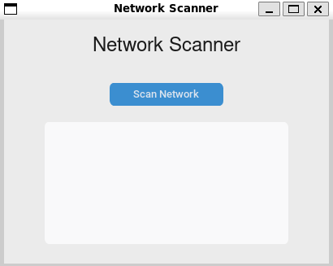

# Python Network Scanner with GUI

This project is a **local network scanner** built using Python's `scapy` library for packet crafting and `customtkinter` for a sleek graphical interface. It performs an **ARP scan** on the local subnet to discover devices connected to your network and displays their IP and MAC addresses in a user-friendly GUI.

---

## 🚀 Features

- ✅ ARP-based network scanning
- ✅ Automatically detects your default gateway and subnet
- ✅ Displays results in both CLI and GUI
- ✅ Built with modern UI using `customtkinter`
- ✅ Works on most Linux systems (and can be adapted for Windows)

---

## 🛠️ Technologies Used

- [Python](https://www.python.org/)
- [Scapy](https://scapy.net/) - For network-level ARP packet manipulation
- [CustomTkinter](https://github.com/TomSchimansky/CustomTkinter) - For modern-looking GUI
- `subprocess` - For shell command execution to retrieve network info

---

## 📷 GUI Preview

> GUI features:
>
> - A button to start scanning
> - A text box to display live scan results (IP & MAC addresses)



---

## ⚙️ Installation

```bash
# Clone the repository
git clone https://github.com/yourusername/python-network-scanner.git
cd python-network-scanner

# Install dependencies
pip install scapy customtkinter
```

---

## ▶️ Usage

### Run the GUI version:

```bash
python scanner.py
```

> The GUI will launch and allow you to scan your network with a single click.

### Run the CLI version:

```bash
python scanner.py
```

> If run directly (outside GUI mainloop), it prints results in the terminal too.

---

## 🔍 How It Works

1. Retrieves the **default gateway** via `ip route` command.
2. Constructs a full **CIDR IP range** (e.g., `192.168.1.0/24`) from the gateway.
3. Sends **ARP requests** to all hosts on the subnet.
4. Collects **responses** to identify live devices.
5. Displays **IP and MAC addresses** in a neatly formatted output.

---

## 🛡️ Note on Permissions

To send ARP requests, this script may require  **root privileges** . On Linux, use:

```bash
sudo python scanner.py
```

---

## 📦 To-Do / Future Features

* [X] Export scan results to CSV/JSON
* [X] Add progress bar during scan
* [X] Implement multi-threading for faster scans
* [X] Platform-agnostic default gateway detection

---

## 🧠 Educational Use

This project is ideal for:

* Networking students
* Cybersecurity learners
* Ethical hackers
* Hobbyists experimenting with Python and GUI design

---

## ⚠️ Disclaimer

This tool is designed  **for educational and ethical purposes only** . Do not use it on networks you don’t own or have permission to scan. Unauthorized scanning may be illegal.

---

## 📄 License

MIT License — Feel free to use and modify with credit.

---

## 🤝 Contributing

Pull requests and ideas are welcome! Let’s build a more advanced scanner together.

---

## 🧑‍💻 Author

**Vedant Sareen**

Cybersecurity enthusiast | Python programmer | GUI addict

> "Scan smart. Stay legal."
